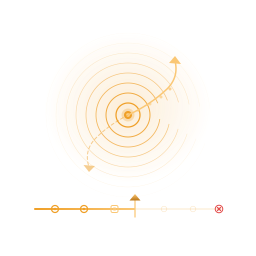

<p align="center">
  
</p>

<h1 align="center">Tracey</h1>

<p align="center">
  Kotlin Multiplatform SDK for recording gestures, screen views, breadcrumbs,<br>
  and crashes — then replaying them as a timeline on Android and iOS.
</p>

<p align="center">
  <a href="https://central.sonatype.com/artifact/com.himanshoe/tracey">
    
  </a>
  <a href="https://github.com/hi-manshu/tracey/blob/main/LICENSE">
    
  </a>
  <a href="https://github.com/hi-manshu/tracey">
    
  </a>
  <a href="https://buymeacoffee.com/himanshoe">
    
  </a>
</p>

<br>

---

## What Tracey does

|                          |                                                                                       |
|--------------------------|---------------------------------------------------------------------------------------|
| 👆 **Gesture recording** | Captures clicks, scrolls, swipes, long presses, and pinches with zero instrumentation |
| 🗺️ **Screen views**     | Tracks every navigation event automatically via `tracey-navigation` or manually       |
| 🍞 **Breadcrumbs**       | Log arbitrary events from anywhere — cart updates, API errors, feature flags          |
| 💥 **Crash replay**      | Snapshots the event ring-buffer on crash and replays it on next launch                |
| 🔒 **Privacy masking**   | Mark sensitive composables — they render normally but are blacked out in captures     |
| 🔌 **Custom reporters**  | Route captured sessions to Logcat, Crashlytics, Sentry, Slack, or your own backend    |

<br>
<p align="center">
<video src="art/sample.mp4" controls></video>
</p>
---

## Quick start

```kotlin
// 1. Add the dependency
commonMain.dependencies {
    implementation("com.himanshoe:tracey:<version>")
}

// 2. Install once in Application.onCreate() or iOS entry point
Tracey.install(TraceyConfig(reporters = listOf(LogcatReporter())))

// 3. Wrap your root composable
setContent {
    TraceyHost(traceyConfig = rememberTraceyConfig(reporters = listOf(LogcatReporter()))) {
        MyApp()
    }
}
```

---

## Documentation

- [Installation](docs/installation.md) — all artifact variants and dependency setup
- [Setup](docs/setup.md) — `TraceyConfig`, `TraceyHost`, `rememberTraceyConfig`
- [Screen tracking](docs/screen-tracking.md) — automatic (Compose Nav, Nav 3) and manual
- [Breadcrumbs & capture](docs/breadcrumbs-and-capture.md) — `Tracey.log`, export methods
- [Privacy masking](docs/privacy-masking.md) — `Modifier.traceyMask()` and redacted tags
- [Reporters](docs/reporters.md) — built-in reporters, log output format, custom reporters
- [Platform support](docs/platform-support.md) — Android vs iOS capabilities

---

## License

```
Copyright 2026 Himanshu Singh

Licensed under the Apache License, Version 2.0 (the "License");
you may not use this file except in compliance with the License.
You may obtain a copy of the License at

    http://www.apache.org/licenses/LICENSE-2.0

Unless required by applicable law or agreed to in writing, software
distributed under the License is distributed on an "AS IS" BASIS,
WITHOUT WARRANTIES OR CONDITIONS OF ANY KIND, either express or implied.
See the License for the specific language governing permissions and
limitations under the License.
```

<p align="center">Made with ❤️ by <a href="https://github.com/hi-manshu">Himanshu Singh</a></p>
